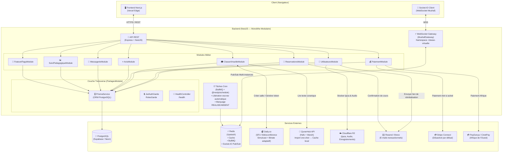
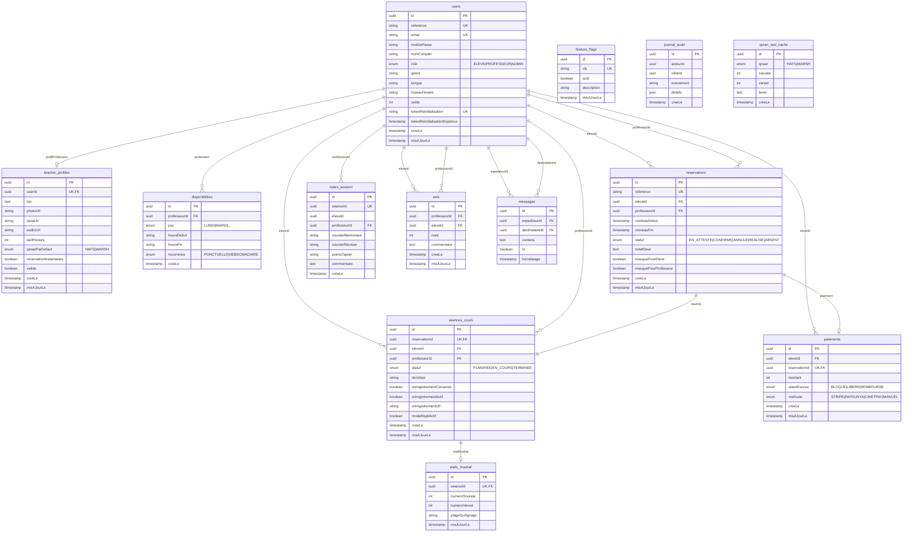
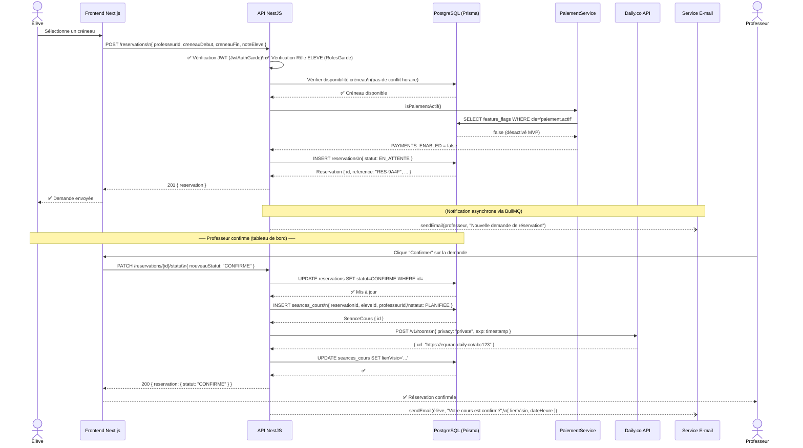
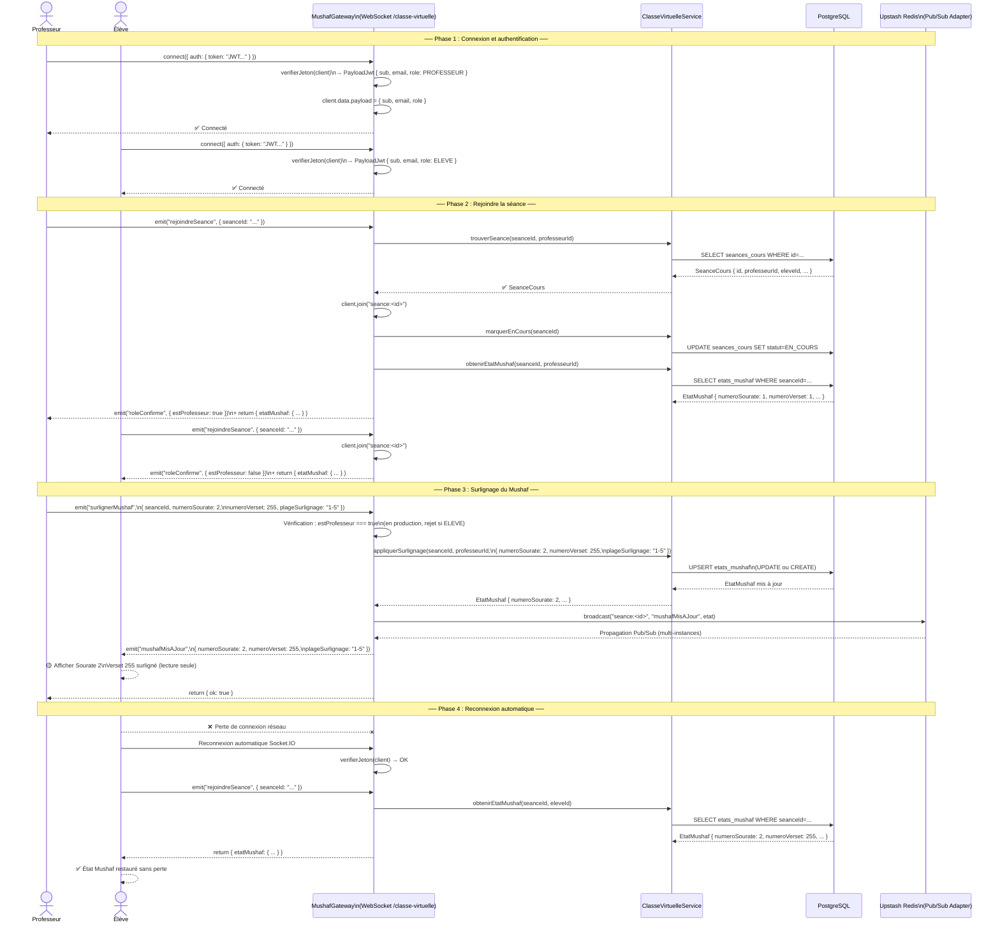
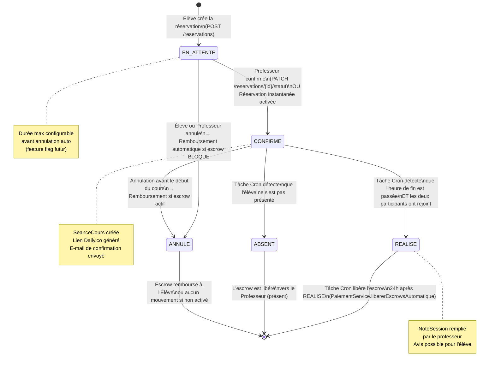
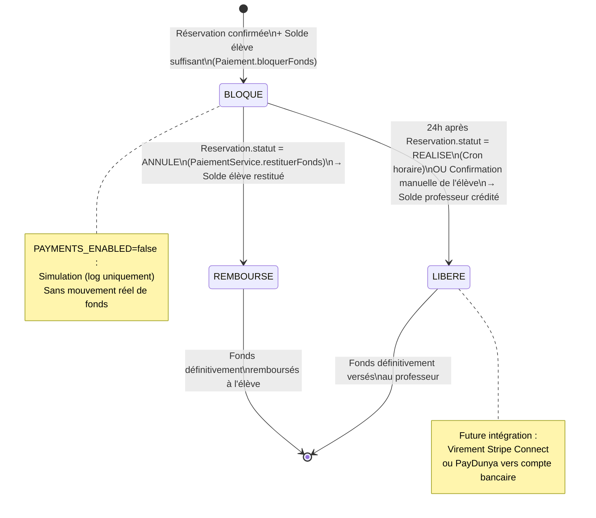
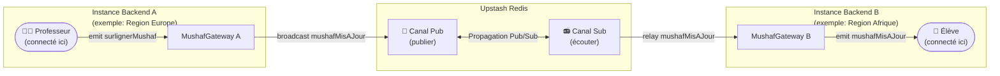

# Architecture Technique & Diagrammes Dynamiques — E-Quran Academy

> **Version** : 1.0 · **Date** : 2026-09-28 · **Convention** : UML 2.5 — Notation Mermaid

---

## 1. Architecture Globale du Système

---

## 2. Diagramme Entité-Association (ERD)

---

## 3. Diagramme de Séquence — Flux de Réservation Complet

Ce diagramme illustre l'ensemble des interactions entre composants lors d'une réservation standard (flux classique, sans réservation instantanée).

---

## 4. Diagramme de Séquence — Synchronisation WebSocket Mushaf en Temps Réel

---

## 5. Diagramme d'États — Cycle de Vie d'une Réservation

---

## 6. Diagramme d'États — Cycle de Vie du Séquestre (Escrow Paiement)

---

## 7. Synchronisation Multi-Instances (Redis Pub/Sub)

Le diagramme ci-dessous illustre comment la synchronisation WebSocket est assurée lorsque plusieurs instances du backend sont actives (Phase 4+). Le `@socket.io/redis-adapter` est déjà intégré dans le code MVP.

> **Note** : En développement mono-instance, l'adaptateur Redis est bypassé automatiquement si `REDIS_URL` est absente (`WARN: gateway mono-instance`). La plateforme reste entièrement fonctionnelle.
