# Cas d'Utilisation — E-Quran Academy

> **Version** : 1.0 · **Date** : 2026-09-28 · **Statut** : MVP (Phase 1-3)

---

## 1. Diagramme Global des Cas d'Utilisation

Ce diagramme UML représente l'ensemble des interactions entre les acteurs (Élève/Parent, Professeur, Administrateur, Système) et les cas d'utilisation de la plateforme.

```mermaid
graph LR
    subgraph Acteurs
        E(["👤 Élève / Parent"])
        P(["👨‍🏫 Professeur"])
        A(["🛡️ Administrateur"])
        S(["⚙️ Système"])
    end

    subgraph "Module Authentification"
        UC01["UC-01\nS'inscrire"]
        UC02["UC-02\nSe connecter / Déconnecter"]
        UC03["UC-03\nRéinitialiser son mot de passe"]
        UC04["UC-04\nConsulter / Modifier son profil"]
    end

    subgraph "Module Professeurs"
        UC05["UC-05\nGérer son profil public\n(bio, Ijaza, audio, tarif)"]
        UC06["UC-06\nGérer ses disponibilités"]
        UC07["UC-07\nValider un compte Professeur"]
    end

    subgraph "Module Réservations"
        UC08["UC-08\nRechercher un professeur"]
        UC09["UC-09\nRéserver un cours"]
        UC10["UC-10\nGérer les demandes de réservation"]
        UC11["UC-11\nAnnuler une réservation"]
    end

    subgraph "Module Salle de Classe"
        UC12["UC-12\nRejoindre la salle de classe\nvirtuelle"]
        UC13["UC-13\nSurligner le Mushaf\n(Professeur → Read-Only Élève)"]
        UC14["UC-14\nActiver le mode repli\n(Faible bande passante)"]
        UC15["UC-15\nRemplir la note de fin de cours"]
    end

    subgraph "Module Paiement"
        UC16["UC-16\nGérer le portefeuille (solde)"]
        UC17["UC-17\nBloquer / Libérer les fonds\n(Escrow)"]
        UC18["UC-18\nCréditer manuellement (Admin)"]
    end

    subgraph "Module Social"
        UC19["UC-19\nLaisser un avis"]
        UC20["UC-20\nEnvoyer / Recevoir des messages"]
    end

    subgraph "Module Administration"
        UC21["UC-21\nGérer les Feature Flags"]
        UC22["UC-22\nConsulter le Journal d'Audit"]
    end

    E --> UC01
    E --> UC02
    E --> UC03
    E --> UC04
    E --> UC08
    E --> UC09
    E --> UC11
    E --> UC12
    E --> UC16
    E --> UC19
    E --> UC20

    P --> UC02
    P --> UC04
    P --> UC05
    P --> UC06
    P --> UC10
    P --> UC12
    P --> UC13
    P --> UC14
    P --> UC15
    P --> UC20

    A --> UC07
    A --> UC18
    A --> UC21
    A --> UC22

    S --> UC17
    S --> UC14
```



---

## 2. Cas d'Utilisation Détaillés

---

### UC-01 — S'inscrire sur la plateforme

| Champ | Détail |
|---|---|
| **Acteur principal** | Visiteur (futur Élève/Parent) |
| **Déclencheur** | Le visiteur clique sur « Créer un compte » |
| **Préconditions** | L'adresse e-mail n'est pas déjà utilisée |
| **Postconditions** | Un compte utilisateur avec le rôle `ELEVE` est créé en base |

**Scénario nominal :**
1. Le visiteur accède au formulaire d'inscription.
2. Il saisit son nom complet, son adresse e-mail, son mot de passe et son fuseau horaire.
3. Le système valide les données (format e-mail, longueur mot de passe, unicité).
4. Le système crée le compte avec le rôle `ELEVE` imposé (rôle `PROFESSEUR` uniquement attribué par un admin).
5. Le système retourne le profil créé (sans mot de passe).

**Scénarios d'exception :**
- **E1 (E-mail déjà existant)** : Le système retourne une erreur 409 « Adresse e-mail déjà utilisée ».
- **E2 (Données invalides)** : Le système retourne une erreur 400 avec le détail des champs invalides.
- **E3 (Rate-limit)** : Après 5 tentatives en 60 secondes, le système retourne une erreur 429.

---

### UC-02 — Se connecter et se déconnecter

| Champ | Détail |
|---|---|
| **Acteur principal** | Utilisateur inscrit (Élève, Professeur, Admin) |
| **Déclencheur** | Saisie des identifiants sur la page de connexion |
| **Préconditions** | Le compte existe et n'est pas suspendu |
| **Postconditions** | Un cookie `jwt_access` (httpOnly) est positionné dans le navigateur |

**Scénario nominal — Connexion :**
1. L'utilisateur saisit son e-mail et son mot de passe.
2. Il peut cocher « Se souvenir de moi » pour une durée de session de 30 jours (sinon 1 jour).
3. Le système vérifie les identifiants (bcrypt).
4. Le système génère un jeton JWT signé et le place dans un cookie `httpOnly` (protégé contre XSS).
5. Le système retourne le profil utilisateur et le jeton JWT en corps de réponse.

**Scénario nominal — Déconnexion :**
1. L'utilisateur clique sur « Se déconnecter ».
2. Le système efface le cookie `jwt_access`.

**Scénarios d'exception :**
- **E1 (Identifiants incorrects)** : Le système retourne une erreur 401.
- **E2 (Rate-limit brute-force)** : Après 10 tentatives en 60 secondes, le système retourne une erreur 429.

---

### UC-03 — Réinitialiser son mot de passe

| Champ | Détail |
|---|---|
| **Acteur principal** | Utilisateur inscrit |
| **Déclencheur** | Clic sur « Mot de passe oublié » |
| **Préconditions** | L'adresse e-mail correspond à un compte existant |
| **Postconditions** | Le nouveau mot de passe est enregistré en base (haché) |

**Scénario nominal :**
1. L'utilisateur saisit son adresse e-mail sur la page « Mot de passe oublié ».
2. Le système génère un token de réinitialisation à durée limitée (24h) et l'enregistre sur le compte.
3. Le système envoie un e-mail transactionnel avec le lien contenant le token.
4. L'utilisateur clique sur le lien et saisit son nouveau mot de passe.
5. Le système valide le token (non expiré), met à jour le mot de passe (bcrypt) et invalide le token.

**Scénarios d'exception :**
- **E1 (E-mail inconnu)** : Pour des raisons de sécurité, le système retourne toujours un message de succès neutre (évite l'énumération d'e-mails).
- **E2 (Token expiré ou invalide)** : Le système retourne une erreur 400.
- **E3 (Rate-limit)** : Maximum 3 demandes par heure par IP.

---

### UC-08 — Rechercher un professeur

| Champ | Détail |
|---|---|
| **Acteur principal** | Élève / Parent (visiteur ou connecté) |
| **Déclencheur** | Accès à la page « Trouver un professeur » |
| **Préconditions** | Des profils professeurs validés existent en base |
| **Postconditions** | La liste des professeurs correspondants est affichée |

**Scénario nominal :**
1. L'élève accède à la liste des professeurs.
2. Il peut filtrer par : langue d'enseignement, tranche de tarif horaire, genre du professeur, qiraat (Hafs ou Warsh), note moyenne.
3. La liste est paginée et retourne uniquement les profils validés (`valide = true`).
4. L'élève peut consulter le profil public détaillé d'un professeur (bio, Ijaza, audio de démonstration, avis).

---

### UC-09 — Réserver un cours

| Champ | Détail |
|---|---|
| **Acteur principal** | Élève / Parent (connecté, rôle `ELEVE`) |
| **Acteur secondaire** | Professeur (reçoit la demande) |
| **Déclencheur** | Clic sur « Réserver ce créneau » sur le profil d'un professeur |
| **Préconditions** | L'élève est connecté ; le créneau est disponible ; le solde est suffisant si paiements activés |
| **Postconditions** | Une `Reservation` est créée avec le statut `EN_ATTENTE` (ou `CONFIRME` si réservation instantanée) ; une `SeanceCours` est créée |

**Scénario nominal (flux classique) :**
1. L'élève sélectionne un créneau disponible sur le profil du professeur.
2. Il saisit une note optionnelle pour le professeur.
3. Le système vérifie la disponibilité du créneau (pas de double réservation).
4. Si `PAYMENTS_ENABLED=true`, le système vérifie le solde de l'élève et séquestre le montant (`BLOQUE`).
5. Le système crée la `Reservation` au statut `EN_ATTENTE`.
6. Le professeur reçoit une notification e-mail pour confirmation.
7. Le professeur confirme → statut passe à `CONFIRME`.
8. Le système crée automatiquement la `SeanceCours` et le lien Daily.co.

**Scénario alternatif (réservation instantanée) :**
- À l'étape 5, si `reservationInstantanee = true` sur le profil du professeur, le statut passe directement à `CONFIRME` et la `SeanceCours` est créée immédiatement.

**Scénarios d'exception :**
- **E1 (Créneau déjà pris)** : Erreur 409 « Ce créneau n'est plus disponible ».
- **E2 (Solde insuffisant)** : Erreur 400 « Solde insuffisant pour réserver ce cours ».
- **E3 (Professeur non validé)** : Erreur 403 « Ce professeur n'est pas encore disponible à la réservation ».

---

### UC-10 — Gérer les demandes de réservation (Professeur)

| Champ | Détail |
|---|---|
| **Acteur principal** | Professeur (connecté, rôle `PROFESSEUR`) |
| **Déclencheur** | Réception d'une nouvelle demande de réservation |
| **Préconditions** | Une réservation au statut `EN_ATTENTE` existe pour ce professeur |
| **Postconditions** | La réservation passe au statut `CONFIRME` ou `ANNULE` |

**Scénario nominal (confirmation) :**
1. Le professeur consulte son tableau de bord → liste des réservations en attente.
2. Il consulte le détail (créneau, note de l'élève, nom de l'élève).
3. Il clique sur « Confirmer » → le statut passe à `CONFIRME`.
4. Le système crée la `SeanceCours` et le lien Daily.co si non encore créé.
5. Le système envoie une notification à l'élève.

**Scénario alternatif (refus) :**
- Le professeur clique sur « Refuser » → le statut passe à `ANNULE`.
- Si les fonds étaient séquestrés, ils sont automatiquement restitués à l'élève.

---

### UC-12 — Rejoindre la salle de classe virtuelle

| Champ | Détail |
|---|---|
| **Acteurs** | Élève ET Professeur (tous deux connectés) |
| **Déclencheur** | Clic sur « Rejoindre le cours » 5 minutes avant le début ou pendant la séance |
| **Préconditions** | La réservation est au statut `CONFIRME` ; une `SeanceCours` avec un `lienVisio` existe |
| **Postconditions** | Les deux participants sont connectés à la salle Daily.co et à la room WebSocket Mushaf |

**Scénario nominal :**
1. L'utilisateur clique sur « Rejoindre le cours ».
2. Le frontend récupère le lien Daily.co et charge le widget vidéo.
3. Le client WebSocket se connecte au namespace `classe-virtuelle` avec le jeton JWT.
4. Le serveur authentifie le jeton et attache le payload (`eleveId` ou `professeurId`) au socket.
5. Le client émet `rejoindreSeance` avec le `seanceId`.
6. Le serveur joint le socket à la room `seance:<id>` et retourne le dernier état du Mushaf.
7. Le serveur marque la `SeanceCours` au statut `EN_COURS`.
8. Le client reçoit `roleConfirme` : `{ estProfesseur: true/false }`.
9. Le Mushaf est affiché en lecture seule pour l'élève ; en mode interactif pour le professeur.

**Scénario de reconnexion :**
- Si la connexion WebSocket est interrompue (réseau instable), le client se reconnecte automatiquement.
- À la reconnexion, le serveur renvoie le dernier état du Mushaf → aucune perte d'état.

**Scénarios d'exception :**
- **E1 (Jeton JWT invalide)** : Le serveur déconnecte immédiatement le socket et émet `erreur: { message: 'Authentification requise' }`.
- **E2 (Séance introuvable ou accès non autorisé)** : Le serveur émet `erreur` et retourne `{ etatMushaf: null }`.

---

### UC-13 — Surligner le Mushaf en temps réel

| Champ | Détail |
|---|---|
| **Acteur principal** | Professeur (seul autorisé à émettre) |
| **Acteur secondaire** | Élève (reçoit en lecture seule) |
| **Déclencheur** | Le professeur touche / clique sur un verset du Mushaf |
| **Préconditions** | Le professeur a rejoint la room `seance:<id>` ; son rôle est `PROFESSEUR` |
| **Postconditions** | L'état du Mushaf est persisté en base (`EtatMushaf`) et broadcasté à toute la room |

**Scénario nominal :**
1. Le professeur sélectionne une sourate, un verset et une plage de surlignage optionnelle.
2. Le client émet l'événement WebSocket `surlignerMushaf` avec le payload `{ seanceId, numeroSourate, numeroVerset, plageSurlignage }`.
3. Le serveur vérifie que l'émetteur est bien le professeur de la séance (en production).
4. Le serveur persiste l'état dans `EtatMushaf` via `ClasseVirtuelleService.appliquerSurlignage()`.
5. Le serveur broadcast `mushafMisAJour` à toute la room.
6. L'interface de l'élève met à jour l'affichage du Mushaf (verset surligné).

**Contrainte de sécurité :**
> En production (`NODE_ENV=production`), si un élève tente d'émettre `surlignerMushaf`, le serveur rejette la requête avec `erreur: { message: 'Seul le professeur peut surligner le Mushaf' }`.

---

### UC-17 — Cycle de vie du Séquestre (Escrow)

| Champ | Détail |
|---|---|
| **Acteur principal** | Système (automatique) |
| **Acteurs secondaires** | Élève (déclencheur de réservation), Professeur (bénéficiaire), Admin (crédit manuel) |
| **Déclencheur** | Confirmation d'une réservation (`CONFIRME`) |
| **Préconditions** | `PAYMENTS_ENABLED=true` via Feature Flag ; solde de l'élève suffisant |
| **Postconditions** | Les fonds sont séquestrés (`BLOQUE`), puis libérés (`LIBERE`) ou remboursés (`REMBOURSE`) |

**Scénario nominal :**
```
Élève réserve → Solde débité → Paiement.statutEscrow = BLOQUE
    ↓
Cours réalisé (Reservation.statut = REALISE)
    ↓
Attente 24h (tâche cron toutes les heures)
    ↓
Paiement.statutEscrow = LIBERE → Solde Professeur crédité
```

**Scénario d'exception (annulation) :**
```
Reservation.statut = ANNULE
    ↓
Paiement.statutEscrow = REMBOURSE → Solde Élève restitué
```

---

### UC-21 — Gérer les Feature Flags (Admin)

| Champ | Détail |
|---|---|
| **Acteur principal** | Administrateur |
| **Déclencheur** | Accès au panneau d'administration des fonctionnalités |
| **Préconditions** | L'utilisateur est connecté avec le rôle `ADMIN` |
| **Postconditions** | Le flag est activé ou désactivé sans redéploiement |

**Flags clés du système :**

| Clé | Description | Défaut |
|---|---|---|
| `paiement.actif` | Active les transactions réelles (Stripe/PayDunya) | `false` |
| `reservation.instantanee` | Permet aux professeurs d'activer la réservation instantanée | `true` |
| `enregistrement.actif` | Active le module d'enregistrement des séances | `false` |
