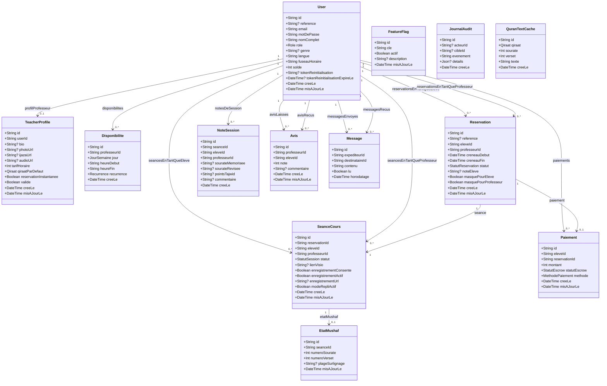
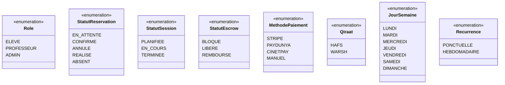
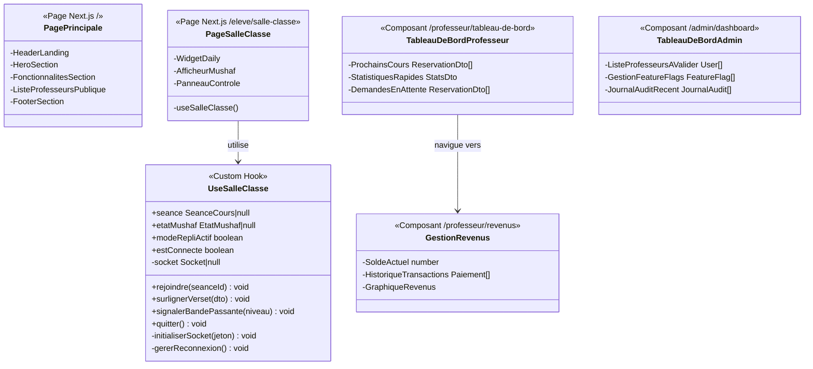

# Diagrammes de Classes UML — E-Quran Academy

> **Version** : 1.0 · **Date** : 2026-09-28 · **Convention** : UML 2.5 — Notation Mermaid

---

## 1. Diagramme de Classes du Domaine (Modèle de Données)

Ce diagramme représente le modèle de données complet tel que défini dans le schéma Prisma (`backend/prisma/schema.prisma`). Il couvre les entités, leurs attributs, les relations entre elles et les énumérations métier.

---

## 2. Énumérations Métier (Enums)

---

## 3. Diagramme de Classes — Architecture Applicative Backend (NestJS)

Ce diagramme représente la structure des modules, contrôleurs, services et gateways NestJS, avec les dépendances entre composants applicatifs.

```mermaid
classDiagram
    direction TB

    %% ═══════════════════════════════════════════════
    %% MODULE PARTAGÉ (Couche transverse)
    %% ═══════════════════════════════════════════════
    class PartagesModule {
        <<Module NestJS>>
        Exporte : PrismaService
        Exporte : JwtModule
        Exporte : BullModule
    }

    class PrismaService {
        <<Service Injectable>>
        +$connect() Promise~void~
        +$disconnect() Promise~void~
        +$transaction(fn) Promise~T~
        +user PrismaUser
        +reservation PrismaReservation
        +seanceCours PrismaSeanceCours
        +paiement PrisamPaiement
        +...
    }

    class JwtAuthGarde {
        <<Guard NestJS>>
        +canActivate(ctx) boolean
        -extraireJetonDuCookie(req) string
        -extraireJetonDuHeader(req) string
    }

    class RolesGarde {
        <<Guard NestJS>>
        +canActivate(ctx) boolean
    }

    %% ═══════════════════════════════════════════════
    %% MODULE UTILISATEURS
    %% ═══════════════════════════════════════════════
    class UtilisateursModule {
        <<Module NestJS>>
    }

    class UtilisateursControleur {
        <<Controller REST /utilisateurs>>
        +inscrire(dto) Promise~UtilisateurReponseDto~
        +connecter(dto, res) Promise~ConnexionReponse~
        +demanderReinitialisation(dto) Promise~MessageReponse~
        +reinitialiserMotDePasse(dto) Promise~MessageReponse~
        +deconnecter(res) Object
        +moi(utilisateur, res, req) Promise~UtilisateurReponseDto~
        +mettreAJour(utilisateur, dto) Promise~UtilisateurReponseDto~
        +changerRole(id, dto, admin) Promise~UtilisateurReponseDto~
        +listerTous(role) Promise~UtilisateurReponseDto[]~
        +validerProfesseur(id, admin) Promise~UtilisateurReponseDto~
        +rejeterProfesseur(id, admin) Promise~UtilisateurReponseDto~
    }

    class UtilisateursService {
        <<Service Injectable>>
        +inscrire(dto) Promise~UtilisateurReponseDto~
        +connecter(dto) Promise~ConnexionResultat~
        +trouverParId(id) Promise~UtilisateurReponseDto~
        +mettreAJour(id, dto) Promise~UtilisateurReponseDto~
        +changerRole(id, role, adminId) Promise~UtilisateurReponseDto~
        +listerTous(role) Promise~UtilisateurReponseDto[]~
        +validerProfesseur(id, adminId) Promise~UtilisateurReponseDto~
        +rejeterProfesseur(id, adminId) Promise~UtilisateurReponseDto~
        +demanderReinitialisation(email) Promise~Resultat~
        +reinitialiserMotDePasse(token, mdp) Promise~Resultat~
        -hacher(mdp) Promise~string~
        -verifier(mdp, hash) Promise~boolean~
    }

    class ProfesseursControleur {
        <<Controller REST /professeurs>>
        +listerProfesseurs(filtres) Promise~PageReponse~
        +trouverProfesseur(id) Promise~ProfilProfesseurDto~
        +mettreAJourMonProfil(utilisateur, dto) Promise~ProfilDto~
    }

    class ProfesseursService {
        <<Service Injectable>>
        +listerProfesseurs(filtres) Promise~PageReponse~
        +trouverProfesseur(id) Promise~ProfilProfesseurDto~
        +mettreAJourProfil(userId, dto) Promise~ProfilDto~
    }

    %% ═══════════════════════════════════════════════
    %% MODULE RÉSERVATIONS
    %% ═══════════════════════════════════════════════
    class ReservationsModule {
        <<Module NestJS>>
    }

    class ReservationsControleur {
        <<Controller REST /reservations>>
        +listerDisponibilites(id, pagination) Promise~PageReponse~
        +creerDisponibilite(utilisateur, dto) Promise~DisponibiliteDto~
        +supprimerDisponibilite(utilisateur, id) Promise~void~
        +creerReservation(utilisateur, dto) Promise~ReservationDto~
        +listerMesReservations(utilisateur, pagination) Promise~PageReponse~
        +listerReservationsProfesseur(utilisateur, pagination) Promise~PageReponse~
        +trouverReservation(utilisateur, id) Promise~ReservationDto~
        +changerStatut(utilisateur, id, dto) Promise~ReservationDto~
        +supprimerReservation(utilisateur, id) Promise~MessageReponse~
    }

    class ReservationsService {
        <<Service Injectable>>
        +creerDisponibilite(userId, dto) Promise~DisponibiliteDto~
        +supprimerDisponibilite(userId, id) Promise~void~
        +listerDisponibilites(userId, pagination) Promise~PageReponse~
        +creerReservation(eleveId, dto) Promise~ReservationDto~
        +listerReservations(userId, pagination, estProf) Promise~PageReponse~
        +trouverReservation(id, userId) Promise~ReservationDto~
        +changerStatut(id, statut, userId) Promise~ReservationDto~
        +supprimerReservationDefinitivement(id, userId) Promise~Resultat~
        -creerSeanceApresConfirmation(reservation) Promise~void~
        -verifierConflitHoraire(professeurId, debut, fin) Promise~void~
    }

    class ReservationsCron {
        <<Cron NestJS>>
        +marquerCoursRealises() Promise~void~
        +marquerCoursAbsents() Promise~void~
    }

    %% ═══════════════════════════════════════════════
    %% MODULE CLASSE VIRTUELLE
    %% ═══════════════════════════════════════════════
    class ClasseVirtuelleModule {
        <<Module NestJS>>
    }

    class ClasseVirtuelleControleur {
        <<Controller REST /classe-virtuelle>>
        +obtenirSeance(utilisateur, id) Promise~SeanceDto~
        +obtenirTokenVisio(utilisateur, id) Promise~TokenDto~
        +terminerSeance(utilisateur, id) Promise~SeanceDto~
        +obtenirVerset(utilisateur, sourate, verset, qiraat) Promise~VersetDto~
        +obtenirSourate(utilisateur, sourate, qiraat) Promise~VersetDto[]~
    }

    class ClasseVirtuelleService {
        <<Service Injectable>>
        +trouverSeance(seanceId, userId) Promise~SeanceCours~
        +obtenirTokenVisio(seanceId, userId) Promise~TokenVisio~
        +marquerEnCours(seanceId) Promise~SeanceCours~
        +terminerSeance(seanceId, userId) Promise~SeanceCours~
        +obtenirEtatMushaf(seanceId, userId) Promise~EtatMushaf~
        +appliquerSurlignage(seanceId, userId, dto) Promise~EtatMushaf~
        +basculerModeRepli(seanceId, activer, userId) Promise~SeanceCours~
        +obtenirVerset(sourate, verset, qiraat) Promise~VersetDto~
        +obtenirSourate(sourate, qiraat) Promise~VersetDto[]~
    }

    class MushafGateway {
        <<WebSocket Gateway /classe-virtuelle>>
        -server Server
        +afterInit(server) Promise~void~
        +handleConnection(client) Promise~void~
        +handleDisconnect(client) Promise~void~
        +rejoindreSeance(client, corps) Promise~EtatMushaf~
        +surlignerMushaf(client, dto) Promise~Ok~
        +signalerBandePassante(client, dto) Promise~ModeRepli~
        -verifierJeton(client) PayloadJwt|null
        -nomRoom(seanceId) string
        -seanceDeLaRoom(client) string|null
    }

    %% ═══════════════════════════════════════════════
    %% MODULE PAIEMENT
    %% ═══════════════════════════════════════════════
    class PaiementModule {
        <<Module NestJS>>
    }

    class PaiementControleur {
        <<Controller REST /paiement>>
        +obtenirSolde(utilisateur) Promise~SoldeDto~
        +simulerRecharge(utilisateur, dto) Promise~SoldeDto~
        +crediterManuellement(admin, dto) Promise~SoldeDto~
        +listerTransactions(utilisateur) Promise~Paiement[]~
    }

    class PaiementService {
        <<Service Injectable>>
        +chargerSolde(userId) Promise~number~
        +simulerRecharge(userId, montant) Promise~SoldeDto~
        +crediterManuellement(email, montant) Promise~SoldeDto~
        +isPaiementActif() Promise~boolean~
        +bloquerFonds(eleveId, reservationId, montant) Promise~void~
        +restituerFonds(reservationId) Promise~void~
        +libererFonds(reservationId) Promise~void~
        +libererEscrowsAutomatique() Promise~void~
        +listerTransactions(userId) Promise~Paiement[]~
    }

    %% ═══════════════════════════════════════════════
    %% Relations entre modules
    %% ═══════════════════════════════════════════════
    UtilisateursModule --> PartagesModule : importe
    ReservationsModule --> PartagesModule : importe
    ClasseVirtuelleModule --> PartagesModule : importe
    PaiementModule --> PartagesModule : importe

    UtilisateursControleur --> UtilisateursService : injecte
    UtilisateursModule --> ProfesseursControleur : contient
    ProfesseursControleur --> ProfesseursService : injecte

    ReservationsControleur --> ReservationsService : injecte
    ReservationsService --> PaiementService : injecte (séquestre)
    ReservationsCron --> ReservationsService : utilise

    ClasseVirtuelleControleur --> ClasseVirtuelleService : injecte
    MushafGateway --> ClasseVirtuelleService : injecte
    MushafGateway --> JwtAuthGarde : utilise (handshake)

    PaiementControleur --> PaiementService : injecte

    UtilisateursService --> PrismaService : injecte
    ReservationsService --> PrismaService : injecte
    ClasseVirtuelleService --> PrismaService : injecte
    PaiementService --> PrismaService : injecte
```

---

## 4. Diagramme de Classes — Composants Frontend (Next.js)

Ce diagramme représente les principaux composants React et hooks personnalisés du frontend, organisés par espace utilisateur.

